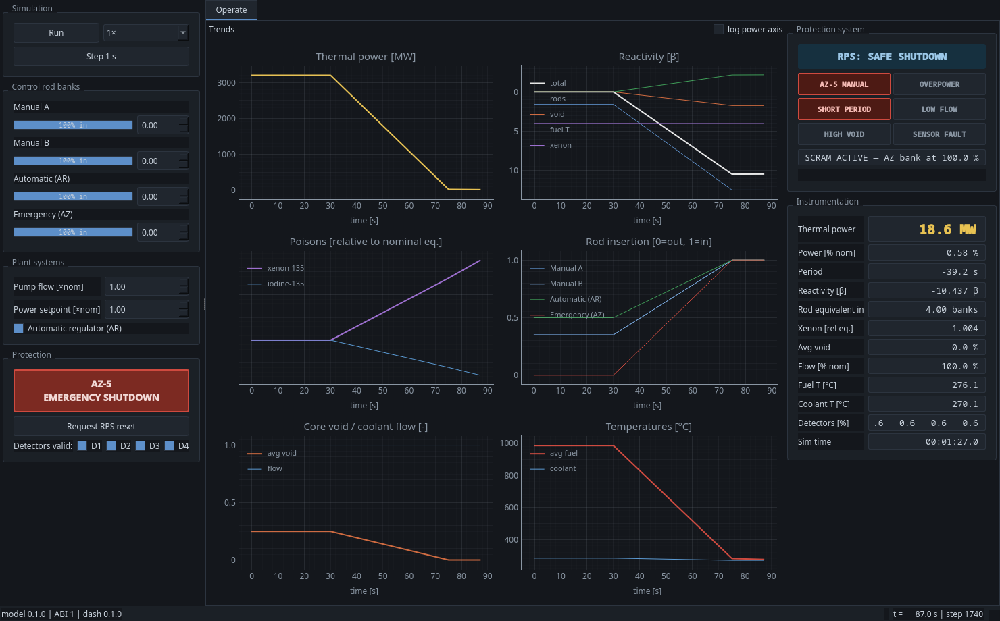
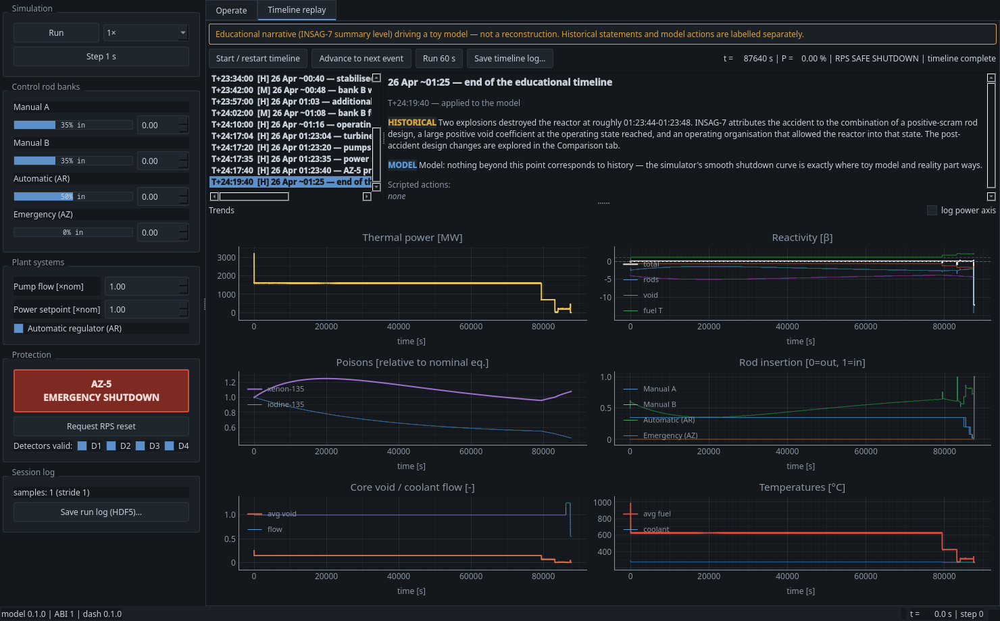
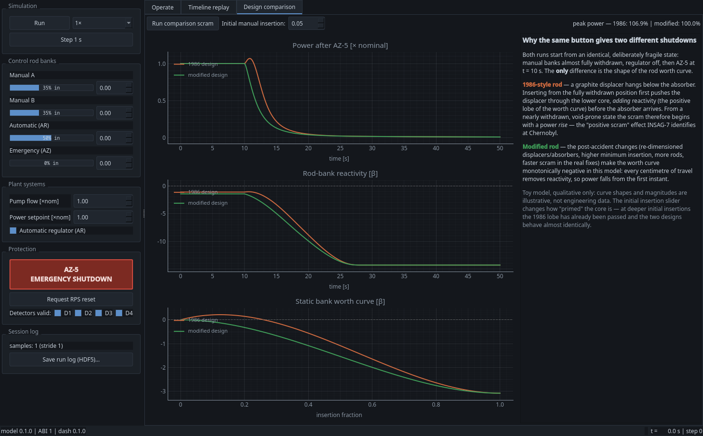

# RBMK-SIM — Educational RBMK-1000-Inspired Reactor Simulator

An educational, deterministic, multi-language simulator inspired by the RBMK-1000
channel-type reactor. The project exists to teach **software engineering for
safety-related systems** — simulation kernels, protection logic, formal specification,
deterministic logging, and safety-case documentation — using a famous and well-documented
piece of engineering history as its subject.

> ## Important safety boundary
>
> **This is an educational toy. It is not a reactor model.**
>
> - All physical coefficients are simplified, public, textbook-level values chosen for
>   qualitative behavior only. They are deliberately **non-operational**.
> - The simulator must **not** be used for reactor operation, operator training,
>   prediction, design, licensing, or any real-world safety analysis.
> - The Chernobyl timeline mode is an educational narrative based on public summaries
>   (IAEA INSAG-7 level); the model output alongside it is qualitative illustration,
>   not reconstruction.
>
> The full statement of assumptions, limitations and prohibited uses lives in the
> safety case (`docs/safety_case/`).



## What it does

- **Simplified channel-reactor kernel (C++17)** — point kinetics with six delayed-neutron
  groups, per-channel coolant void and fuel temperature feedback, iodine/xenon poisoning,
  control-rod banks with position-dependent worth curves, detector models, automatic
  power regulator with a period governor. Deterministic: fixed step, fixed order,
  bit-reproducible runs.
- **Reactor protection system (C11)** — a MISRA-inspired, allocation-free, latched
  trip/alarm state machine (overpower, short period, low flow, high void, sensor fault,
  manual AZ-5; hysteresis on every threshold; strict reset permissives) scanned at a
  fixed cadence by the orchestrator, which exports a versioned C ABI.
- **Accident timeline replay** — step through an annotated educational timeline of
  25/26 April 1986 (24h17m of simulated time, never compressed): the half-power hold
  and its xenon transient, the slump to ~1%, the rod-withdrawal recovery, the pump and
  rundown phases, and the AZ-5 scram with its brief positive power excursion. Historical
  narrative and model actions are always labelled separately.
- **Design evolution comparison** — the same scram under the 1986-style rod (graphite
  displacer "positive scram" lobe) versus a modified monotonic rod, side by side, with
  the static worth curves and a plain-language explanation.
- **Engineering dashboard (Python / PySide6)** — restrained control-room aesthetic:
  simulation clock with speed multipliers, rod/flow/regulator controls, AZ-5 and RPS
  reset, detector fault injection, live trends, instrumentation readouts, protection
  annunciator, session export.
- **Deterministic HDF5 logs** — every run records its full description (model version,
  config, step-indexed command log, stride-sampled timeseries, timeline events).
  `rbmk-logtool verify` re-executes the log and requires bit-exact agreement.
- **Formal specification (TLA+)** — a TLC-checked model of the protection state machine
  (latch safety, no trip-to-normal shortcut, safe-state reachability under an explicit
  plant-response fairness assumption).
- **Safety case (Sphinx)** — purpose, scope, assumptions, limitations, prohibited uses,
  architecture, protection rationale, determinism guarantees, verification strategy.

| Timeline replay | Design comparison |
|---|---|
|  |  |

## Repository layout

See [`CONTEXT_MAP.md`](CONTEXT_MAP.md) for the full map and per-component contracts.

```
kernel/        C++ physics kernel            protection/   C protection system (RPS)
orchestrator/  coupling loop + C ABI         fortran/      optional Fortran numerics
dashboard/     PySide6 UI + HDF5 tooling     scenarios/    scenario & timeline data
specs/tla/     TLA+ spec of the RPS          docs/         Sphinx docs & safety case
```

## Quickstart

Native core (requires `gcc`/`g++`, CMake ≥ 3.25, `ninja`):

```sh
cmake --preset release && cmake --build --preset release   # library for the dashboard
cmake --preset dev && cmake --build --preset dev
ctest --preset dev                                         # kernel + RPS + orchestrator
```

Python environment, dashboard and tests:

```sh
python3 -m venv .venv
.venv/bin/pip install -r requirements.txt
.venv/bin/pip install -e dashboard
.venv/bin/python -m rbmk_dash                              # launch the dashboard
.venv/bin/python -m pytest dashboard/tests
```

Documentation (builds the safety case):

```sh
.venv/bin/sphinx-build -W -b html docs docs/_build/html
```

Run logs:

```sh
rbmk-logtool info   runs/myrun.h5
rbmk-logtool export runs/myrun.h5 --out myrun.csv
rbmk-logtool verify runs/myrun.h5      # bit-exact deterministic replay check
```

### Optional components

- **Fortran numerics** — `sudo dnf install gcc-gfortran`, then reconfigure; without it
  a parity-tested C++ twin of the same algorithm is used (the model version string
  records which numerics produced every log).
- **TLA+ model checking** — Java 11+; fetch `tla2tools.jar` per `specs/tla/README.md`,
  then `java -jar tools/tla2tools.jar -config RPS.cfg RPS.tla` from `specs/tla/`.
- **Sanitizer builds** — `sudo dnf install libasan libubsan`, then use the `dev-asan`
  preset.

## Verification status

All of the following run clean from this tree: the three native ctest suites
(doctest kernel, Unity RPS, doctest coupled-ABI), the pytest suite (bindings,
session, HDF5 round-trip/replay, timeline, comparison, UI smoke), `ruff`,
`clang-format`, the `tidy` preset (clang-tidy, documented exclusions), TLC on
the protection spec, and a warning-free Sphinx build. See
`docs/safety_case/verification.md` for the claim-to-check mapping.

## Sources and further reading

The educational narrative draws on public, high-level summaries, principally
IAEA INSAG-7, *The Chernobyl Accident: Updating of INSAG-1* (1992), and standard
reactor-physics textbooks for the qualitative phenomena (delayed neutrons, xenon
poisoning, void and Doppler feedback). No proprietary or operational data is used.

## Contributing

See [.github/CONTRIBUTING.md](.github/CONTRIBUTING.md) for development setup,
verification, code style, and pull-request expectations.

## License

MIT — see [LICENSE](LICENSE). The educational-use boundary above is a statement of
intent and scope, not a license restriction.
